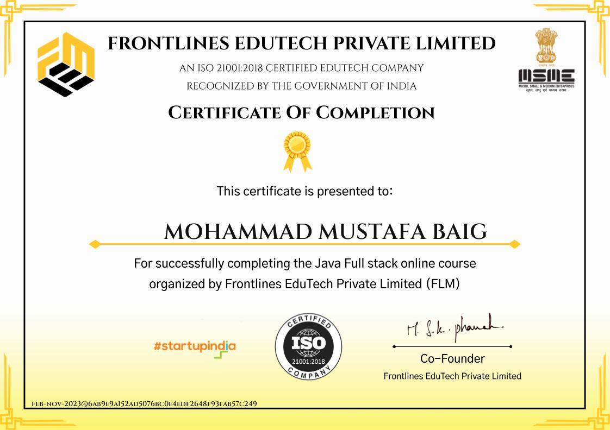

# Hi, I'm Mohammad Mustafa Baig 👋

🚀 Java Backend Developer | 3 Years Experience  
📍 Hyderabad, Telangana, India  
📧 mustafamohammad738@gmail.com  

## 🛠️ Tech Stack
!☕ Java 8 / 11 / 17  
!🌱 Spring Boot  
!📨 Kafka 
!☸️ Kubernetes 
!🐳 Docker 

## 💼 Experience
- **Systems Engineer @ Infosys** (Feb 2022 – Feb 2025)
  - Spring Boot Microservices, Spring Batch, Kafka, REST APIs
  - CI/CD: GitHub Actions + Argo CD
  - Monitoring: Splunk, Dynatrace, Kibana

## 🏆 Achievements
- ✅ Java Full Stack Development Certification - Frontlines EduTech Private Limited

### 📜 Certificate

## 📫 Connect with Me
!💼 [LinkedIn](www.linkedin.com/in/mohammadmustafabaig)
